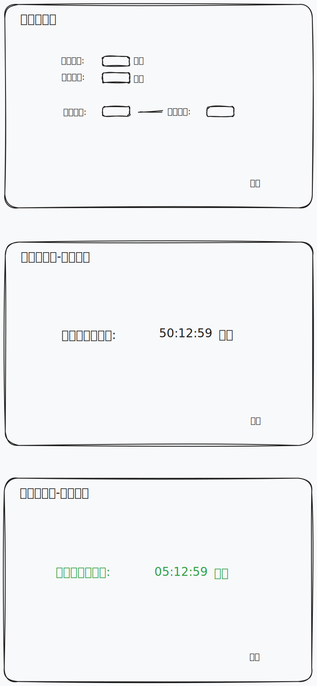

# 番茄工作法 (Pomodoro Timer)

这是一个基于Go语言开发的Windows桌面应用，用于帮助用户实践番茄工作法，提高工作效率和时间管理能力。

## 功能特点

- 可自定义工作时间（最多60分钟）
- 可自定义休息时间（最多60分钟）
- 可设置应用的工作时间范围（起始时间和结束时间）
- 工作时间结束后自动弹出提醒
- 休息时间结束后自动弹出提醒
- 简洁现代的用户界面
## 应用界面 草稿图


## 使用方法

1. 在设置界面输入：
   - 工作时间（分钟）
   - 休息时间（分钟）
   - 起始时间（24小时制）
   - 结束时间（24小时制）

2. 点击"开始"按钮启动计时器
   - 注意：当前时间必须在设定的起始时间和结束时间范围内

3. 工作时间倒计时结束后，应用会自动弹出提醒，并切换到休息时间

4. 休息时间倒计时结束后，应用会自动弹出提醒，并切换回工作时间

5. 在任意界面点击"结束"按钮可以返回到设置界面

## 构建与运行

### 依赖项

- Go 1.20或更高版本
- github.com/lxn/walk - Windows应用工具包
- github.com/lxn/win - Windows API封装

### 构建步骤

1. 克隆仓库

```
git clone https://github.com/user/go-task-timer.git
cd go-task-timer
```

2. 安装依赖

```
go mod tidy
```

3. 构建应用

```
go build -ldflags="-H windowsgui" -o PomodoroTimer.exe

或者 

go build -ldflags="-H windowsgui -s -w" -o EyeProtectionTimer.exe
```

4. 运行应用

```
./PomodoroTimer.exe
```

## 注意事项

- 应用需要在Windows环境下运行
- 确保设置的时间范围包含当前时间，否则无法启动计时器
- 建议根据个人情况设置合适的工作和休息时间，一般建议工作25-50分钟，休息5-10分钟